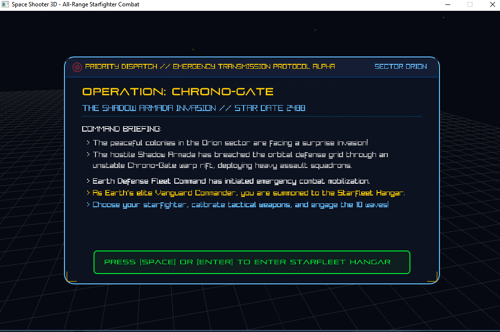
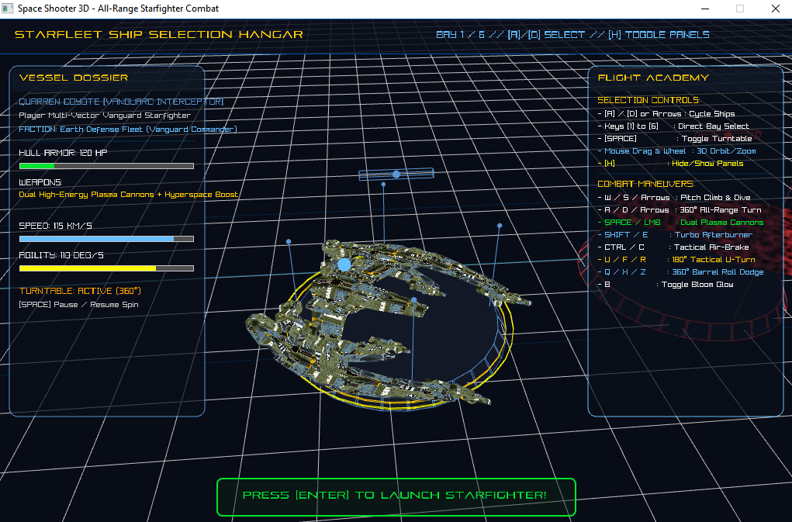
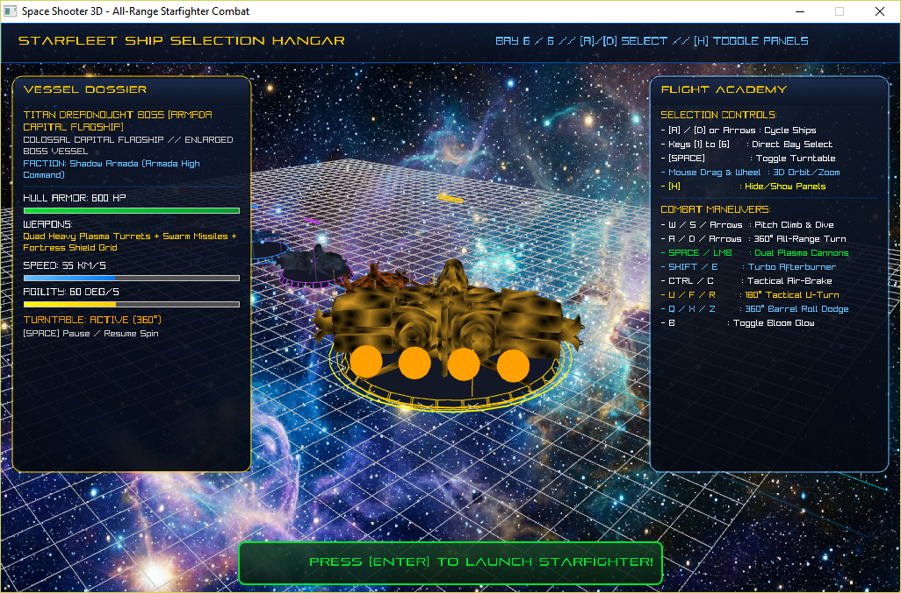
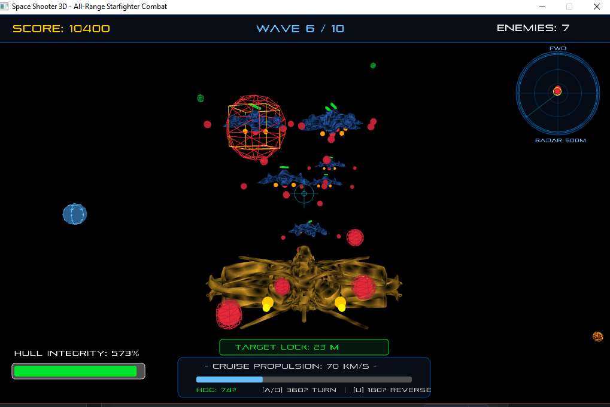

# Space Shooter 3D (RayLib + Ring)
=====================================

A full 3D all-range space combat simulator and dogfight interceptor built using the **Ring programming language** and **RayLib 5.0**.

---

## 🌌 Lore & Story: Operation Chrono-Gate

> **Year 2742 — The Deep Orion Expanse**

The hostile **Shadow Armada** has invaded the outer perimeter of the civilized galaxy, seizing control of the ancient **Chrono-Gates** (the rotating, 12-conduit quantum rings resembling cosmic clocks that regulate hyperspace travel). 

You are the vanguard pilot of the **Quarren Coyote Interceptor**, an experimental multi-vector starfighter equipped with 360° all-range flight capabilities and dual high-energy plasma cannons.

### Game Flow:
1. **Prologue Story Transmission (`STATE_STORY`):** Cinematic command dispatch introducing the threat of the Shadow Armada invading Sector Orion. Press `[SPACE]` or `[ENTER]` to enter the Starfleet Hangar.
2. **3D Starfleet Hangar & Selection Area (`STATE_HANGAR`):** Full 3D exhibition area with 6 starfighter bays on anti-gravity pedestals.
   - Cycle starfighters with `[A] / [D]` or `[Left] / [Right]` or instant keys `[1] - [6]`.
   - Inspect full technical dossiers (Hull Armor, Weapons, Speed, Turn Agility).
   - Read the Flight Academy manual detailing maneuvers.
   - Free camera orbit and zoom with mouse.
   - Press **`[ENTER]`** to confirm and launch the chosen vessel into combat!
3. **Active 360° Dogfight Combat (`STATE_PLAYING`):** Pilot your selected starfighter while the unselected vessels form the enemy armada waves across 10 escalating combat encounters.

---

## 📸 Gameplay Screenshots

| 🛰️ Story Prologue & Mission Briefing | 🚀 3D Starfleet Hangar & Selection |
| :---: | :---: |
|  |  |

| 🛡️ Capital Flagship & Flight Academy | ⚔️ 360° All-Range Space Dogfight |
| :---: | :---: |
|  |  |

---

## 🎮 Flight Controls & Selection Keys

| Key / Input | Function |
| :--- | :--- |
| **A / D** or **Left / Right Arrows** | Hangar: Cycle Starfighters // Combat: 360° All-Range Steering & Bank |
| **1 to 6** | Hangar: Instant direct starfighter bay selection |
| **Mouse Drag & Wheel** | Hangar: Free 3D orbit and zoom camera inspection |
| **ENTER** | Hangar: **Launch Selected Starfighter into Combat** // Game Over: Retry |
| **W / S** or **Up / Down Arrows** | Pitch elevation and dive (Climb & Dive) |
| **U** or **F** or **R** | **180° Tactical Immelmann U-Turn** (Instant reverse flip to attack pursuers) |
| **Q** or **Z** / **X** | **360° Acrobatic Barrel Roll** (Invulnerable evasive dodge) |
| **SHIFT** or **E** | Afterburner thruster surge **(Hyperspace Boost)** |
| **CTRL** or **C** | Tactical reverse-thrust air-brakes **(Brake)** |
| **SPACE** or **Left Mouse Button** | Hangar: Pause/Resume Turntable // Combat: Fire Dual Plasma Cannons |
| **B** | Toggle Bloom Post-Processing Glow Shader (OFF/ON) |
| **H** | Return to Starfleet Hangar from Game Over / Victory screen |

---

## 🛸 Project Architecture & OOP Classes

The entire game is architected using clean, modular Object-Oriented Programming (OOP) in Ring:

```text
spaceshooter/
│
├── SpaceShooter3D.ring   # class SpaceShooterGame (Master orchestrator & Bloom pipeline)
├── ShipShowroom.ring     # Standalone 3D Starfleet Showroom & Inspection Hangar Arena
├── Config.ring           # Global constants, colors, math & particle helpers
├── Player.ring           # class PlayerShip (6DOF flight, 360° steering & rendering)
├── ShipRegistry.ring     # Unified Starfleet Registry (Single Source of Truth for 3D vessels)
├── Enemies.ring          # class EnemyFleet (Dogfight AI state machine & 10 waves)
├── Weapons.ring          # class WeaponSystem (Dual plasma cannons & ballistics)
├── Environment.ring      # class Starfield, AsteroidField & ChronoGate (Warp rings)
├── HUD.ring              # class CockpitHUD (Chase camera, telemetry & mini-radar)
│
├── data/
│   ├── quarren_coyote_ship.obj   # Player Vanguard Starfighter
│   ├── plane_diffuse.png         # Starfighter diffuse texture map
│   ├── fighter_38/               # Fighter 38 High-Agility Recon Scout Drone
│   ├── fighter_232/              # Fighter 232 Heavy Assault Strike Raider
│   └── enemy_fighter.obj         # Intergalactic Razor Interceptor & Titan Boss
│
└── Assets/
    ├── bloom.fs          # Post-processing GLSL Bloom glow shader
    ├── Dimensions.ogg    # Epic orchestral space soundtrack
    ├── laser1.ogg        # Player plasma cannon audio
    ├── raval.wav         # Upgraded cannon rapid laser salvo audio
    ├── laser2.ogg        # Enemy laser audio
    ├── Explosion+3.wav   # Combat explosion audio (enemies, asteroids, player)
    └── health.ogg        # Hyper-gate warp surge & powerup audio
```

---

## ⚔️ Key Visual & Gameplay Features

1. **Dedicated 3D Enemy Fleet Models:** Each hostile class features its own unique 3D model geometry (Scout Dart, Heavy Fighter, Forward-Swept Razor Interceptor, and Titan Flagship) with custom propulsion exhausts and health bars.
2. **Post-Processing Bloom Lighting (`bloom.fs`):** Full-screen HDR Bloom shader gives plasma lasers, thruster plumes, warp gates, and explosions radiant neon glows.
3. **Deep Cosmic Nebulae & Multi-Spectral Stars:** 340+ stars categorized into realistic spectral classes (Blue Giants, Solar Golds, Red Dwarfs, Pure Whites) across a 380m field with distant glowing gas clouds.
4. **Connected Radiant Chrono-Gates:** Celestial warp gates with rotating hour-nodes linked by plasma energy beams and pulsating portal rings.
5. **Tactical Mini-Radar Screen:** Real-time 360° side radar (250m range) displaying player heading, rotating sweep beam, range rings, and plotting nearby enemy hostiles as bright red dots with target lock reticles.
6. **Glassmorphic Cockpit HUD & Aerospace Typography:** Sleek rounded cockpit instrument panels (`DrawRectangleRounded`) with Pirulen sci-fi typography.
7. **True 360° All-Range Flight:** Unrestricted 6DOF flight mechanics without 2D plane restrictions or gimbal locking.

---

## 📦 Installation via Ring Package Manager (RingPM)

You can install and run the game directly using `ringpm`:

```bash
ringpm install SpaceShooter3D from Azzeddine2017
```

Then run the game with:

```bash
ringpm run SpaceShooter3D
```

---

## 🕹️ How to Run Locally

### Main Game:
```bash
ring SpaceShooter3D.ring
```

### 3D Starfleet Showroom & Inspection Arena:
```bash
ring ShipShowroom.ring
```
